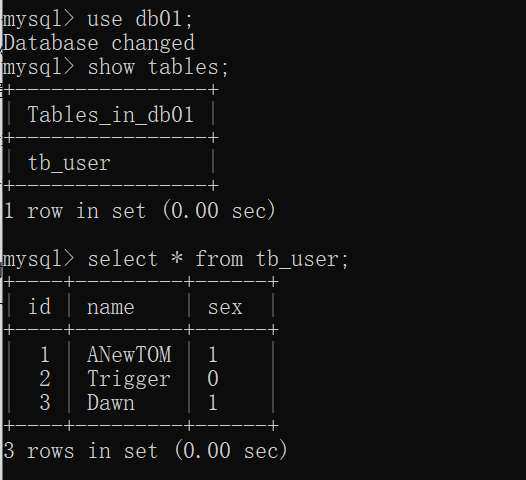

# MySql 基础
## 1. DQL语句执行顺序


# MySql进阶
## 1. 存储引擎


1. 连接层
最上层是一些客户端和链接服务，包含本地sock 通信和大多数基于客户端/服务端工具实现的类似于TCP/IP的通信。主要完成一些类似于连接处理、授权认证、及相关的安全方案。在该层上引入了线程池的概念，为通过认证安全接入的客户端提供线程。同样在该层上可以实现基于SSL的安全链接。服务器也会为安全接入的每个客户端验证它所具有的操作权限。

2. 服务层
第二层架构主要完成大多数的核心服务功能，如SQL接口，并完成缓存的查询，SQL的分析和优化，部分内置函数的执行。所有跨存储引擎的功能也在这一层实现，如 过程、函数等。在该层，服务器会解析查询并创建相应的内部解析树，并对其完成相应的优化如确定表的查询的顺序，是否利用索引等，最后生成相应的执行操作。如果是select语句，服务器还会查询内部的缓存，如果缓存空间足够大，这样在解决大量读操作的环境中能够很好的提升系统的性能。

3. 引擎层
存储引擎层， 存储引擎真正的负责了MySQL中数据的存储和提取，服务器通过API和存储引擎进行通信。不同的存储引擎具有不同的功能，这样我们可以根据自己的需要，来选取合适的存储引擎。数据库中的索引是在存储引擎层实现的。

4. 存储层
数据存储层， 主要是将数据(如: redolog、undolog、数据、索引、二进制日志、错误日志、查询日志、慢查询日志等)存储在文件系统之上，并完成与存储引擎的交互。

- 查询当前数据库支持的存储引擎  
``` 
show engines; 
```

## 2. InnoDB
- InnoDB是一种兼顾高可靠性和高性能的通用存储引擎，在 MySQL 5.5 之后，InnoDB是默认的MySQL 存储引擎。
- 特点  
    - DML操作遵循ACID模型，支持事务；
    - 行级锁，提高并发访问性能；
    - 支持外键FOREIGN KEY约束，保证数据的完整性和正确性


## 3. 索引
- 索引（index）是帮助MySQL高效获取数据的数据结构(有序)。在数据之外，数据库系统还维护着满足特定查找算法的数据结构，这些数据结构以某种方式引用（指向）数据， 这样就可以在这些数据结构上实现高级查找算法，这种数据结构就是索引。

``` 
创建索引  CREATE [ UNIQUE | FULLTEXT ] INDEX index_name ON table_name (index_col_name,... ) ;

查看索引 SHOW INDEX FROM table_name ;

删除索引 DROP INDEX index_name ON table_name ;
```

|优势|劣势|
|---|---|
|提高数据检索的效率，降低数据库的IO成本 |索引列也是要占用空间的。|
|通过索引列对数据进行排序，降低数据排序的成本，降低CPU的消耗。|索引大大提高了查询效率，同时却也降低更新表的速度，如对表进行INSERT、UPDATE、DELETE时，效率降低。|

### 3.1 B+树索引
  - 所有的数据都会出现在叶子节点。
  - 叶子节点形成一个单向链表。
  - 非叶子节点仅仅起到索引数据作用，具体的数据都是在叶子节点存放的。
  - MySQL索引数据结构对经典的B+Tree进行了优化。在原B+Tree的基础上，增加一个指向相邻叶子节点的链表指针，就形成了带有顺序指针的B+Tree，提高区间访问的性能，利于排序。  


思考题： 为什么InnoDB存储引擎选择使用B+tree索引结构?  

    A. 相对于二叉树，层级更少，搜索效率高；  

    B. 对于B-tree，无论是叶子节点还是非叶子节点，都会保存数据，这样导致一页中存储的键值减少，指针跟着减少，要同样保存大量数据，只能增加树的高度，导致性能降低； 另外B+树的所有数据都在叶子结点，在查询时，查询的次数大致相当。 

    C. 相对Hash索引，B+tree支持范围匹配及排序操作；
### 3.2 索引的分类


聚集索引选取规则:
  - 如果存在主键，主键索引就是聚集索引。
  - 如果不存在主键，将使用第一个唯一（UNIQUE）索引作为聚集索引。
  - 如果表没有主键，或没有合适的唯一索引，则InnoDB会自动生成一个rowid作为隐藏的聚集索引。

### 3.3 回表查询

-  由于是根据name字段进行查询，所以先根据name='Arm'到name字段的二级索引中进行匹配查找。但是在二级索引中只能查找到 Arm 对应的主键值 10。
-  ②. 由于查询返回的数据是*，所以此时，还需要根据主键值10，到聚集索引中查找10对应的记录，最终找到10对应的行row。
-  这种先到二级索引中查找数据，找到主键值，然后再到聚集索引中根据主键值，获取数据的方式，就称之为回表查询。


### 3.4 Sql性能分析
```
    查看各种语句执行次数 
    SHOW GLOBAL STATUS LIKE 'Com_______';

    # 开启MySQL慢日志查询开关
    slow_query_log=1
    # 设置慢日志的时间为2秒，SQL语句执行时间超过2秒，就会视为慢查询，记录慢查询日志
    long_query_time=2

    是否支持 profile
    SELECT @@have_profiling ;

    -- 查看每一条SQL的耗时基本情况
    show profiles;
    -- 查看指定query_id的SQL语句各个阶段的耗时情况
    show profile for query query_id;
```
- explain

|字段| 含义|
|---|---|
|id|select查询的序列号，表示查询中执行select子句或者是操作表的顺序(id相同，执行顺序从上到下；id不同，值越大，越先执行)。|
|select_type|表示 SELECT 的类型，常见的取值有 SIMPLE（简单表，即不使用表连接或者子查询）、PRIMARY（主查询，即外层的查询）、UNION（UNION 中的第二个或者后面的查询语句）、SUBQUERY（SELECT/WHERE之后包含了子查询）等|
|type|表示连接类型，性能由好到差的连接类型为NULL、system、const、eq_ref、ref、range、 index、all 。|
|possible_key |显示可能应用在这张表上的索引，一个或多个。|
|key| 实际使用的索引，如果为NULL，则没有使用索引。|
|key_len|表示索引中使用的字节数， 该值为索引字段最大可能长度，并非实际使用长度，在不损失精确性的前提下， 长度越短越好 。|
|rows|MySQL认为必须要执行查询的行数，在innodb引擎的表中，是一个估计值，可能并不总是准确的。|
filtered |表示返回结果的行数占需读取行数的百分比， filtered 的值越大越好。|


### 3.5 强大的索引


- 一张一千万数据的表在添加索引前后的查询时间

### 3.6 索引的使用
1. 最左前缀法则  
   - 如果索引了多列（联合索引），要遵守最左前缀法则。最左前缀法则指的是查询从索引的最左列开始，并且不跳过索引中的列。如果跳跃某一列，索引将会部分失效(后面的字段索引失效)。
   - 注意 最左前缀法则中指的最左边的列，是指在查询时，联合索引的最左边的字段(即是第一个字段)必须存在，与我们编写SQL时，条件编写的先后顺序无关。
   - 这与联合索引的结构也就是B+树有关
2. 范围查询
   - 联合索引中，出现范围查询(>,<)，范围查询右侧的列索引失效。
   - 所以，在业务允许的情况下，尽可能的使用类似于 >= 或 <= 这类的范围查询，而避免使用 > 或 <
   - 为什么像 >= 这样的可以走索引。实际上是被拆分为>和=两部分。
3. 在索引列上进行运算操作，索引将失效  
4. 字符串类型字段使用时，不加引号，索引将失效。  

   - 如上图 "10">9 返回1 既为真 说明mysql是将字符串转换为数据类型
```
例如:  explain select * from evt_sms where phone = 13020733815
变为:  explain select * from evt_sms where cast(phone as signed int) = 13020733815;
```
5. 模糊匹配
   - 如果仅仅是尾部模糊匹配，索引不会失效。如果是头部模糊匹配，索引失效。
6. or  
   - 用or分割开的条件， 如果or前的条件中的列有索引，而后面的列中没有索引，那么涉及的索引都不会被用到。
7. 数据分布影响  
   - 如果MySQL评估使用索引比全表更慢，则不使用索引。
```
use index ： 建议MySQL使用哪一个索引完成此次查询（仅仅是建议，mysql内部还会再次进行评估）。

explain select * from tb_user use index(idx_user_pro) where profession = '软件工程';

ignore index ： 忽略指定的索引。

explain select * from tb_user ignore index(idx_user_pro) where profession = '软件工程';

force index ： 强制使用索引。

explain select * from tb_user force index(idx_user_pro) where profession = '软件工程';

```
8. 覆盖索引
   - 尽量使用覆盖索引，减少select *。 那么什么是覆盖索引呢？ 覆盖索引是指 查询使用了索引，并且需要返回的列，在该索引中已经全部能够找到 。
   - 实际上是为了避免回表查询

|Extra| 含义|
|---|---|
|Using where; UsingIndex|查找使用了索引，但是需要的数据都在索引列中能找到，所以不需要回表查询数据|
|Using index condition|查找使用了索引，但是需要回表查询数据|

9. 前缀索引
    - 当字段类型为字符串（varchar，text，longtext等）时，有时候需要索引很长的字符串，这会让索引变得很大，查询时，浪费大量的磁盘IO， 影响查询效率。此时可以只将字符串的一部分前缀，建立索引，这样可以大大节约索引空间，从而提高索引效率。
```
create index idx_xxxx on table_name(column(n)) ;
```

10. 单列索引与联合索引  
    单列索引：即一个索引只包含单个列。  
联合索引：即一个索引包含了多个列。

### 3.7 索引设计原则


## 4. SQL优化
### 4.1 insert语句
1. 批量插入
```
Insert into tb_test values(1,'Tom'),(2,'Cat'),(3,'Jerry');
```
2. 手动控制事务
```
start transaction;
insert into tb_test values(1,'Tom'),(2,'Cat'),(3,'Jerry');
insert into tb_test values(4,'Tom'),(5,'Cat'),(6,'Jerry');
insert into tb_test values(7,'Tom'),(8,'Cat'),(9,'Jerry');
commit;
```
3. 主键顺序插入
- 主键乱序插入有可能出现页分裂  

- 还有页合并
  
- 索引设计  
  - 满足业务需求的情况下，尽量降低主键的长度。
  - 插入数据时，尽量选择顺序插入，选择使用AUTO_INCREMENT自增主键。
  - 业务操作时，避免对主键的修改。

### 4.2 order by 语句
- Using filesort : 通过表的索引或全表扫描，读取满足条件的数据行，然后在排序缓冲区sort buffer中完成排序操作，所有不是通过索引直接返回排序结果的排序都叫 FileSort 排序。
- Using index : 通过有序索引顺序扫描直接返回有序数据，这种情况即为 using index，不需要额外排序，操作效率高。对于以上的两种排序方式，Using index的性能高，而Using filesort的性能低，我们在优化排序操作时，尽量要优化为 Using index。

- 根据排序字段建立合适的索引，多字段排序时，也遵循最左前缀法则。
-  尽量使用覆盖索引。
-  多字段排序, 一个升序一个降序，此时需要注意联合索引在创建时的规则（ASC/DESC）。
-   如果不可避免的出现filesort，大数据量排序时，可以适当增大排序缓冲区大小sort_buffer_size(默认256k)。

### 4.3 group by 
 - 在分组操作时，可以通过索引来提高效率。
- 分组操作时，索引的使用也是满足最左前缀法则的。

### 4.4 limit
如果对于有where 条件，又想走索引用limit的，必须设计一个索引，将where 放第一位，limit用到的主键放第2位，而且只能select 主键！这样能提高读取速度

### 4.5 count优化
- MyISAM 引擎把一个表的总行数存在了磁盘上，因此执行 count(*) 的时候会直接返回这个数，效率很高； 但是如果是带条件的count，MyISAM也慢。
- InnoDB 引擎就麻烦了，它执行 count(*) 的时候，需要把数据一行一行地从引擎里面读出来，然后累积计数。
---
## 5.视图、存储过程、触发器
---
## 6.锁
### 6.1 事务
1. 事务的四大特性
   - 原子性（Atomicity）：事务是不可分割的最小操作单元，要么全部成功，要么全部失败。
   - 一致性（Consistency）：事务完成时，必须使所有的数据都保持一致状态。
   - 隔离性（Isolation）：数据库系统提供的隔离机制，保证事务在不受外部并发操作影响的独立环境下运行。
   - 持久性（Durability）：事务一旦提交或回滚，它对数据库中的数据的改变就是永久的。  
   上述就是事务的四大特性，简称ACID。
2. 事务并发问题
   - 脏读：一个事务读到另一个事务还没提交的数据
   
   - 不可重复读：一个事务先后读取同一条记录，但两次读取的数据不同，称之为不可重复读。
   ```
   把事务隔离级别改为读提交级别
   set global transaction isolation level read committed;
   ```
   
   -  幻读：一个事务按照条件查询数据时，没有对应的数据行，但是在插入数据时，又发现这行数据已经存在，好像出现了 "幻影"。

   
3. 事务隔离级别

|隔离级别| 脏读| 不可重复读 |幻读|
|---|---|---|---|
|Read uncommitted| √| √| √|
|Read committed |× |√| √|
|Repeatable Read(默认) |× |×| √|
|Serializable |× |× |×|

   - 数据定义语言(DDL)、数据查询语言（DQL）、数据操纵语言（DML）、数据控制语言（DCL）

### 6.2 mySql的锁
- 全局锁：锁定数据库中的所有表。
- 表级锁：每次操作锁住整张表。
- 行级锁：每次操作锁住对应的行数据。

### 6.3 全局锁  
   - 全局锁就是对整个数据库实例加锁，加锁后整个实例就处于只读状态，后续的DML的写语句，DDL语句，已经更新操作的事务提交语句都将被阻塞
   - 使用场景 ： 是做全库的逻辑备份，对所有的表进行锁定，从而获取一致性视图，保证数据的完整性  
   
   ```
   加全局锁 flush tables with read lock ;

   释放锁 unlock tables ; 

   在InnoDB引擎中，我们可以在备份时加上参数 --single-transaction 参数来完成不加锁的一致性数据备份。

   mysqldump --single-transaction -uroot –p123456 itcast > itcast.sql
   ```

### 6.4 表级锁  
   - 表级锁，每次操作锁住整张表。锁定粒度大，发生锁冲突的概率最高，并发度最低。应用在MyISAM、InnoDB、BDB等存储引擎中。表级锁主要有三种 表锁、元数据锁、意向锁
1. 表锁
   表锁主要分为两类
   1. 表共享读锁（read lock）
   2. 表独占写锁（write lock）
   ```
   加锁：lock tables 表名... read/write

   释放锁：unlock tables / 客户端断开连接
   ```

2. 元数据锁  
   - meta data lock , 元数据锁，简写MDL。
   - MDL加锁过程是系统自动控制，无需显式使用，在访问一张表的时候会自动加上。MDL锁主要作用是维护表元数据的数据一致性，在表上有活动事务的时候，不可以对元数据进行写入操作。为了避免DML与DDL冲突，保证读写的正确性。

|对应SQL| 锁类型| 说明|
|---|---|---|
|lock tables xxx read /write|SHARED_READ_ONLY /SHARED_NO_READ_WRITE| |
|select 、select ...、lock in share mode|SHARED_READ|与SHARED_READ、SHARED_WRITE兼容，与EXCLUSIVE互斥
|insert 、update、delete、select ... for update|SHARED_WRITE|与SHARED_READ、SHARED_WRITE兼容，与EXCLUSIVE互斥|
|alter table ... |EXCLUSIVE |与其他的MDL都互斥|
- 在MySQL5.5中引入了MDL，当对一张表进行增删改查的时候，加MDL读锁(共享)；当对表结构进行变
更操作的时候，加MDL写锁(排他)。

3. 意向锁
   - 为了避免DML在执行时，加的行锁与表锁的冲突，在InnoDB中引入了意向锁，使得表锁不用检查每行数据是否加锁，使用意向锁来减少表锁的检查。
   - 例如，某行数据已经加了行锁，另一事务再来加表锁时，需要一行行检查是否有冲突。
   - 意向共享锁(IS): 由语句select ... lock in share mode添加 。 与 表锁共享锁(read)兼容，与表锁排他锁(write)互斥。
   - 意向排他锁(IX): 由insert、update、delete、select...for update添加 。与表锁共享锁(read)及排他锁(write)都互斥，意向锁之间不会互斥。
   - 一旦事务提交了，意向共享锁、意向排他锁，都会自动释放。
   ```
   select object_schema,object_name,index_name,lock_type,lock_mode,lock_data from performance_schema.data_locks;
   ```
   
### 6.5 行级锁
- 行级锁，每次操作锁住对应的行数据。锁定粒度最小，发生锁冲突的概率最低，并发度最高。应用在InnoDB存储引擎中。


1. 行锁  
   - 共享锁（S）：允许一个事务去读一行，阻止其他事务获得相同数据集的排它锁。
   - 排他锁（X）：允许获取排他锁的事务更新数据，阻止其他事务获得相同数据集的共享锁和排他锁。


|SQL| 行锁类型 |说明|
|---|---|---|
|INSERT ... |排他锁| 自动加锁|
|UPDATE ... |排他锁 |自动加锁|
|DELETE ... |排他锁| 自动加锁|
|SELECT（正常）| |不加任何锁| 
|SELECT ... LOCK IN SHARE MODE|共享锁|需要手动在SELECT之后加LOCK IN SHARE MODE|
|SELECT ... FOR UPDATE |排他锁| 需要手动在SELECT之后加FOR UPDATE|
```
select object_schema,object_name,index_name,lock_type,lock_mode,lock_data from performance_schema.data_locks;
```
- 注意 无索引的行锁会升为表锁
2. 间隙锁 & 临键锁
- 关键点在于 这两个锁都是来解决幻读，都是在间隙里做文章
- 间隙锁相当于对一个开区间加锁，临键锁对一个左开右闭区间加锁
- 索引上的等值查询(唯一索引)，给不存在的记录加锁时, 优化为间隙锁 。

- 解释一下，首先在左侧开启事务，对5-8中间不存在的6号主键进行更新。此时，加了间隙锁，锁住5-8之间。在右侧开启事务2，在5-8之间插入数据，由于间隙锁的存在阻塞。左边事务提交之后，右边语句也完成。
- 索引上的等值查询(非唯一普通索引)，向右遍历时最后一个值不满足查询需求时，next-key lock 退化为间隙锁。


- 索引上的范围查询(唯一索引)--会访问到不满足条件的第一个值为止。
- 注意：间隙锁唯一目的是防止其他事务插入间隙。间隙锁可以共存，一个事务采用的间隙锁不会阻止另一个事务在同一间隙上采用间隙锁。

## 7. InnoDB详解
### 7.1 逻辑存储结构


   1. 表空间  
      表空间是InnoDB存储引擎逻辑结构的最高层， 如果用户启用了参数 innodb_file_per_table(在8.0版本中默认开启) ，则每张表都会有一个表空间（xxx.ibd），一个mysql实例可以对应多个表空间，用于存储记录、索引等数据。
   2. 段  
      段，分为数据段（Leaf node segment）、索引段（Non-leaf node segment）、回滚段（Rollback segment），InnoDB是索引组织表，数据段就是B+树的叶子节点， 索引段即为B+树的非叶子节点。段用来管理多个Extent（区）。
   3. 区  
      区，表空间的单元结构，每个区的大小为1M。 默认情况下， InnoDB存储引擎页大小为16K， 即一个区中一共有64个连续的页。
   4. 页
      页，是InnoDB 存储引擎磁盘管理的最小单元，每个页的大小默认为 16KB。为了保证页的连续性，InnoDB 存储引擎每次从磁盘申请 4-5 个区。
   5. 行  
      行，InnoDB 存储引擎数据是按行进行存放的。在行中，默认有两个隐藏字段：
      - Trx_id：每次对某条记录进行改动时，都会把对应的事务id赋值给trx_id隐藏列。
      - Roll_pointer：每次对某条引记录进行改动时，都会把旧的版本写入到undo日志中，然后这个隐藏列就相当于一个指针，可以通过它来找到该记录修改前的信息。
### 7.2 内存结构
   
   参考 : https://juejin.cn/post/7007421609900245000


(1) Buffer Poll
   1. Buffer Pool 用于加速数据的访问和修改，通过将热点数据缓存在内存的方法，最大限度地减少磁盘 IO，加速热点数据的读和写。  在InnoDB的缓冲池中不仅缓存了索引页和数据页，还包含了undo页、插入缓存、自适应哈希索引以及InnoDB的锁信息等等。
   2. 缓冲池以Page页为单位，底层采用链表数据结构管理Page。根据状态，将Page分为三种类型：  
      • free page：空闲page，未被使用。  
      • clean page：被使用page，数据没有被修改过。  
      • dirty page：脏页，被使用page，数据被修改过，也中数据与磁盘的数据产生了不一致。  
   3. Buffer Pool 使用最近最少使用算法（Least Recent Used，LRU）算法淘汰非热点数据页。依据时间局部性原理与空间局部性原理，Buffer Pool 在存储当前活动数据页的时候，会以预读 Read-ahead 的方式缓存目标数据页临近的数据页。
   
   4. 为了解决预读失败的问题，采用分代机制。
      - 具体来说，它将Buffer Pool（缓冲池）分为两部分：New SubList（新子列表）和Old SubList（旧子列表）。当新的数据页被读取到Buffer Pool中时，它们首先被放置在Old SubList的头部。只有当这些数据页再次被访问时，它们才会被移动到New SubList的头部。
      

      
      - 预读失败问题可以引申到缓冲池污染问题，InnoDB 采用时间窗口（Time Window）机制解决缓冲池污染问题：对于 Old SubList 中的数据页，必须在 Old SubList 中停留到达指定时间之后再次被访问到，才能转移到 New SubList 中，默认窗口大小是 1s  
      参考 : https://blog.csdn.net/zgaoq/article/details/107973541  

(2) change Buffer  
   1. 更改缓冲区（针对于非唯一二级索引页），在执行DML语句时，如果这些数据Page没有在Buffer Pool中，不会直接操作磁盘，而会将数据变更存在更改缓冲区 Change Buffer中，在未来数据被读取时，再将数据合并恢复到Buffer Pool中，再将合并后的数据刷新到磁盘中。同时将写操作录入 redo log 中
   2. 原因：
   - 如果查询条件只涉及二级索引，但查询的列并不完全包含在二级索引中，那么InnoDB存储引擎首先需要访问二级索引找到主键的值，然后再根据主键值去聚簇索引中查找相应的行。这种回表操作（即先访问二级索引再访问聚簇索引）增加了磁盘I/O的次数。
   - 二级索引是根据索引键的顺序存储的，而不是按照数据在磁盘上的物理位置。这意味着即使两个索引键在逻辑上相邻，它们在磁盘上的物理位置也可能相距甚远。因此，当需要修改这些索引键时，数据库管理系统（DBMS）可能需要在磁盘上进行多次跳跃来找到并更新相应的索引页。
   - 当向二级索引中添加新的索引项时，如果索引页已满，则需要进行页分裂操作。同样，当删除索引项导致索引页空闲空间过多时，可能需要进行页合并操作。这些操作都需要磁盘I/O来读取和写入索引页，并且由于索引数据的不连续性，它们可能涉及多个磁盘位置的读写。
   - 由于二级索引数据的不连续性，DBMS的缓存（如InnoDB的缓冲池）可能无法有效地缓存相关的索引页。这可能导致频繁的缓存未命中，从而增加了磁盘I/O的次数。特别是在面对大量索引修改操作时，缓存的效率会进一步降低。(是否可以考虑随机预读)
  3. 在缓冲到一定量或系统较空闲时进行 ibuf merge 操作将修改写入磁盘中   
   
(3) Adaptive Hash Index  
- 自适应hash索引，用于优化对Buffer Pool数据的查询。
- MySQL的innoDB引擎中虽然没有直接支持hash索引，但是给我们提供了一个功能就是这个自适应hash索引。因为前面我们讲到过，hash索引在进行等值匹配时，一般性能是要高于B+树的，因为hash索引一般只需要一次IO即可，而B+树，可能需要几次匹配，所以hash索引的效率要高，但是hash索引又不适合做范围查询、模糊匹配等。
InnoDB存储引擎会监控对表上各索引页的查询，如果观察到在特定的条件下hash索引可以提升速度，则建立hash索引，称之为自适应hash索引。自适应哈希索引，无需人工干预，是系统根据情况自动完成。

(4) Log Buffer
- 日志缓冲区，用来保存要写入到磁盘中的log日志数据（redo log 、undo log），默认大小为 16MB，日志缓冲区的日志会定期刷新到磁盘中。如果需要更新、插入或删除许多行的事务，增加日志缓冲区的大小可以节省磁盘 I/O
- 参数:
```
innodb_log_buffer_size：缓冲区大小
innodb_flush_log_at_trx_commit：日志刷新到磁盘时机
```
取值主要包含以下三个：  
    - 1-日志在每次事务提交时写入并刷新到磁盘，默认值。  
    - 0-每秒将日志写入并刷新到磁盘一次。  
    - 2-日志在每次事务提交后写入，并每秒刷新到磁盘一次。
  


### 7.3 磁盘结构


(1) 系统表空间
- 是更改缓冲区的存储区域,内存中 Change Buffer 对应的持久化区域。如果表是在系统表空间而不是每个表文件或通用表空间中创建的，它也可能包含表和索引数据。(在MySQL5.x版本中还包含InnoDB数据字典、undolog等)系统表空间，默认的文件名叫 ibdata1。

(2) 独立表空间  
如果开启了innodb_file_per_table开关 ，则每个表的文件表空间包含单个InnoDB表的数据和索引 ，并存储在文件系统上的单个数据文件中。

(3) 通用表空间

(4) Undo 表空间
- Undo TableSpace 用于存放一个或多个 undo log 文件。默认 undo log 存储与系统表空间中，MySql 5.6 以后支持自定义 Undo log 表空间并存储所有 undo log。一旦用户定义了 Undo Tablespace，则系统表空间中的 Undo log 区域将失效。

(5) 临时表空间
- InnoDB 使用会话临时表空间和全局临时表空间。存储用户创建的临时表等数据。

(6)  Doublewrite Buffer Files
- 双写缓冲用于保证写入磁盘时页数据的完整性，防止发生部分写失效Partial page write问题，
- Doublewrite Buffer 同时存在于磁盘与内存中，大小都为 2MB。由于操作系统的存储单元页大小为 4K，而 InnoDB 默认存储单元页大小为 16K，在数据从 Buffer 中刷写入磁盘时可能会出现页未写完全但系统崩溃的问题。InnoDB 在数据从 Buffer 刷写入磁盘前，先将数据保存于内存的双写缓冲中，达到 16K 后写入磁盘的双写缓冲中，再写入表数据文件，因此数据文件的写入总是按照 16K 单页递增，出现崩溃数据丢失时使用 redo log 恢复，以此保证数据完整性。


(7) Redo Log
- 重做日志，是用来实现事务的持久性。该日志文件由两部分组成：重做日志缓冲（redo logbuffer）以及重做日志文件（redo log）,前者是在内存中，后者在磁盘中。当事务提交之后会把所有修改信息都会存到该日志中, 用于在刷新脏页到磁盘时,发生错误时, 进行数据恢复使用。


### 7.4 后台线程
(1)  Master Thread
- 核心后台线程，负责调度其他线程，还负责将缓冲池中的数据异步刷新到磁盘中, 保持数据的一致性，还包括脏页的刷新、合并插入缓存、undo页的回收 。
(2)  IO Thread
在InnoDB存储引擎中大量使用了AIO来处理IO请求, 这样可以极大地提高数据库的性能，而IOThread主要负责这些IO请求的回调。

(3)  Purge Thread
- 主要用于回收事务已经提交了的undo log，在事务提交之后，undo log可能不用了，就用它来回收

(4) Page Cleaner Thread
- 协助 Master Thread 刷新脏页到磁盘的线程，它可以减轻 Master Thread 的工作压力，减少阻塞

### 7.5 事务原理


1. redo log
   - 重做日志，记录的是事务提交时数据页的物理修改，是用来实现事务的持久性。
   - 该日志文件由两部分组成：重做日志缓冲（redo log buffer）以及重做日志文件（redo logfile）,前者是在内存中，后者在磁盘中。当事务提交之后会把所有修改信息都存到该日志文件中, 用于在刷新脏页到磁盘,发生错误时, 进行数据恢复使用。

   - 也就是说，我们会将redo log日志先写回磁盘，而赃页在合适的时机，也许是多个事务的脏页一起组成一个IO，异步的写回磁盘。在这个过程中，只要redo log写回磁盘，即使我们的数据丢失，也能通过redolog恢复。
   - redo日志降低了刷盘频率。
   - redo日志占用的空间非常小。
   - redo日志是顺序写入磁盘的。在执行事务的过程中，每执行一条语句，就可能产生若干条redo日志，这些日志是按照产生的顺序写入磁盘的，也就是顺序IO。
2. undo log
   - 回滚日志，用于记录数据被修改前的信息 , 作用包含两个 : 提供回滚(保证事务的原子性) 和MVCC(多版本并发控制) 。  
   - 具体的undo log在MVCC中一起讨论。  

### 7.6 MVCC 多版本并发控制 
- 全称 Multi-Version Concurrency Control，多版本并发控制。指维护一个数据的多个版本，使得读写操作没有冲突，快照读为MySQL实现MVCC提供了一个非阻塞读功能。MVCC的具体实现，还需要依赖于数据库记录中的三个隐式字段、undo log日志和readView。
1. 基本概念
   - 当前读  
   读取的是记录的最新版本，读取时还要保证其他并发事务不能修改当前记录，会对读取的记录进行加锁。对于我们日常的操作，如：select ... lock in share mode(共享锁)，select ...for update、update、insert、delete(排他锁)都是一种当前读。
   - 快照读  
   简单的select（不加锁）就是快照读，快照读，读取的是记录数据的可见版本，有可能是历史数据，不加锁，是非阻塞读。  

   - Read Committed：每次select，都生成一个快照读。
   
   - Repeatable Read：开启事务后第一个select语句才是快照读的地方。
   
   - Serializable：快照读会退化为当前读。
2. 隐藏字段  

|隐藏字段| 含义|
|---|---|
|DB_TRX_ID| 最近修改事务ID，记录插入这条记录或最后一次修改该记录的事务ID。|
|DB_ROLL_PTR|回滚指针，指向这条记录的上一个版本，用于配合undo log，指向上一个版本。|
|DB_ROW_ID| 隐藏主键，如果表结构没有指定主键，将会生成该隐藏字段。|
3. undo log
   - 回滚日志，在insert、update、delete的时候产生的便于数据回滚的日志。
   - 当insert的时候，产生的undo log日志只在回滚时需要，在事务提交后，可被立即删除。而update、delete的时候，产生的undo log日志不仅在回滚时需要，在快照读时也需要，不会立即被删除。

4. 版本链
   
   
   - 当事务2执行第一条修改语句时，会记录undo log日志，记录数据变更之前的样子; 然后更新记录，并且记录本次操作的事务ID，回滚指针，回滚指针用来指定如果发生回滚，回滚到哪一个版本。
   
   
   - 当事务3执行第一条修改语句时，也会记录undo log日志，记录数据变更之前的样子; 然后更新记录，并且记录本次操作的事务ID，回滚指针，回滚指针用来指定如果发生回滚，回滚到哪一个版本。
   
   最终我们发现，不同事务或相同事务对同一条记录进行修改，会导致该记录的undolog生成一条记录版本链表，链表的头部是最新的旧记录，链表尾部是最早的旧记录。
5. read view
   ReadView（读视图）是 快照读 SQL执行时MVCC提取数据的依据，记录并维护系统当前活跃的事务（未提交的）id。

   ReadView中包含了四个核心字段：
   |字段| 含义|
   |---|---|
   |m_ids |当前活跃的事务ID集合|
   |min_trx_id| 最小活跃事务ID|
   |max_trx_id| 预分配事务ID，当前最大事务ID+1（因为事务ID是自增的）|
   |creator_trx_id| ReadView创建者的事务ID|

   而在readview中就规定了版本链数据的访问规则：  
   trx_id 代表当前undolog版本链对应事务ID。

   |条件| 是否可以访问| 说明|
   |---|---|---|
   |trx_id ==creator_trx_id|可以访问该版本|成立，说明数据是当前这个事务更改的。|
   |trx_id < min_trx_id |可以访问该版本 |成立，说明数据已经提交了。|
   |trx_id >= max_trx_id |不可以访问该版本|成立，说明该事务是在ReadView生成后才开启。|
   |min_trx_id <= trx_id<= max_trx_id|如果trx_id不在m_ids中，是可以访问该版本的|成立，说明数据已经提交。|

   不同的隔离级别，生成ReadView的时机不同：  
- READ COMMITTED ：在事务中每一次执行快照读时生成ReadView。
- REPEATABLE READ：仅在事务中第一次执行快照读时生成ReadView，后续复用该ReadView。


### 7.7 一些示例


1. 总结


## 8.Mysql管理

1. mysqlbinlog
   由于服务器生成的二进制日志文件以二进制格式保存，所以如果想要检查这些文本的文本格式，就会使用到mysqlbinlog 日志管理工具。
   ```
   语法 ：
   mysqlbinlog [options] log-files1 log-files2 ...
   选项 ：
   -d, --database=name 指定数据库名称，只列出指定的数据库相关操作。
   -o, --offset=# 忽略掉日志中的前n行命令。
   -r,--result-file=name 将输出的文本格式日志输出到指定文件。
   -s, --short-form 显示简单格式， 省略掉一些信息。
   --start-datatime=date1 --stop-datetime=date2 指定日期间隔内的所有日志。
   --start-position=pos1 --stop-position=pos2 指定位置间隔内的所有日志。
   ```
2.  mysqlshow
   mysqlshow 客户端对象查找工具，用来很快地查找存在哪些数据库、数据库中的表、表中的列或者索引。

   ```
   语法 ：
   mysqlshow [options] [db_name [table_name [col_name]]]
   选项 ：
   --count 显示数据库及表的统计信息（数据库，表 均可以不指定）
   -i 显示指定数据库或者指定表的状态信息
   示例：
   #查询test库中每个表中的字段书，及行数
   mysqlshow -uroot -p2143 test --count
   #查询test库中book表的详细情况
   mysqlshow -uroot -p2143 test book --count
   ```

3.  mysqldump
   mysqldump 客户端工具用来备份数据库或在不同数据库之间进行数据迁移。备份内容包含创建表，及插入表的SQL语句。
   ```
   语法 ：
   mysqldump [options] db_name [tables]
   mysqldump [options] --database/-B db1 [db2 db3...]
   mysqldump [options] --all-databases/-A
   连接选项 ：
   -u, --user=name 指定用户名
   -p, --password[=name] 指定密码
   -h, --host=name 指定服务器ip或域名
   -P, --port=# 指定连接端口
   输出选项：
   --add-drop-database 在每个数据库创建语句前加上 drop database 语句
   --add-drop-table 在每个表创建语句前加上 drop table 语句 , 默认开启 ; 不开启 (--skip-add-drop-table)
   -n, --no-create-db 不包含数据库的创建语句
   -t, --no-create-info 不包含数据表的创建语句
   -d --no-data 不包含数据
   -T, --tab=name 自动生成两个文件：一个.sql文件，创建表结构的语句；一个.txt文件，数据文件
   ```
4. mysqlimport/source
   
----
# MySql运维篇

## 1. Mysql日志
1. 错误日志
   - 错误日志是 MySQL 中最重要的日志之一，它记录了当 mysqld 启动和停止时，以及服务器在运行过程中发生任何严重错误时的相关信息。当数据库出现任何故障导致无法正常使用时，建议首先查看此日志
```
show variables like '%log_error%';
```
2. 二进制日志
   - 二进制日志（BINLOG）记录了所有的 DDL（数据定义语言）语句和 DML（数据操纵语言）语句，但不包括数据查询（SELECT、SHOW）语句。
   - 作用：①. 灾难时的数据恢复；②. MySQL的主从复制。在MySQL8版本中，默认二进制日志是开启着的，涉及到的参数如下：
```
show variables like '%log_bin%';
```
|日志格式| 含义|
|---|---|
|STATEMENT| 基于SQL语句的日志记录，记录的是SQL语句，对数据进行修改的SQL都会记录在日志文件中。|
|ROW| 基于行的日志记录，记录的是每一行的数据变更。（默认）|
|MIXED|混合了STATEMENT和ROW两种格式，默认采用STATEMENT，在某些特殊情况下会自动切换为ROW进行记录。

|指令| 含义|
|---|---|
|reset master|删除全部 binlog 日志，删除之后，日志编号，将从 binlog.000001重新开始|
|purge master logs to 'binlog.*'|删除 * 编号之前的所有日志|
|purge master logs before'yyyy-mm-dd hh24:mi:ss'|删除日志为 "yyyy-mm-dd hh24:mi:ss" 之前产生的所有日志|


3. 查询日志
- 查询日志中记录了客户端的所有操作语句，而二进制日志不包含查询数据的SQL语句。默认情况下，查询日志是未开启的。


4. 慢查询日志
- 慢查询日志记录了所有执行时间超过参数 long_query_time 设置值并且扫描记录数不小于min_examined_row_limit 的所有的SQL语句的日志，默认未开启。long_query_time 默认为10 秒，最小为 0， 精度可以到微秒。
- 如果需要开启慢查询日志，需要在MySQL的配置文件 /etc/my.cnf 中配置如下参数：
```
#慢查询日志
slow_query_log=1
#执行时间参数
long_query_time=2
```

默认情况下，不会记录管理语句，也不会记录不使用索引进行查找的查询。可以使用log_slow_admin_statements和 更改此行为 log_queries_not_using_indexes，如下所述。

```
#记录执行较慢的管理语句
log_slow_admin_statements =1
#记录执行较慢的未使用索引的语句
log_queries_not_using_indexes = 1
```

## 2. 主从复制
1. 概述  
   - 主从复制是指将主数据库的 DDL 和 DML 操作通过二进制日志传到从库服务器中，然后在从库上对这些日志重新执行（也叫重做），从而使得从库和主库的数据保持同步。MySQL支持一台主库同时向多台从库进行复制， 从库同时也可以作为其他从服务器的主库，实现链状复制。
   

2. 优点  
     MySQL 复制的优点主要包含以下三个方面：
      - 主库出现问题，可以快速切换到从库提供服务。
      - 实现读写分离，降低主库的访问压力。
      - 可以在从库中执行备份，以避免备份期间影响主库服务。


3. 步骤  
   3.1 修改主库Master配置文件 /etc/my.cnf
   ```
      #mysql 服务ID，保证整个集群环境中唯一，取值范围：1 – 232-1，默认为1
      server-id=1
      #是否只读,1 代表只读, 0 代表读写
      read-only=0
      #忽略的数据, 指不需要同步的数据库
      #binlog-ignore-db=mysql
      #指定同步的数据库
      #binlog-do-db=db01
   ```
   3.2 重启MySQL服务器
   3.3 登录mysql，创建远程连接的账号，并授予主从复制权限
   ```
   #创建itcast用户，并设置密码，该用户可在任意主机连接该MySQL服务
   CREATE USER 'itcast'@'%' IDENTIFIED WITH mysql_native_password BY 'Root@123456';
   #为 'itcast'@'%' 用户分配主从复制权限
   GRANT REPLICATION SLAVE ON *.* TO 'itcast'@'%';
   ```
   3.4 查看主库二进制日志
   ```
      show master status ;
   ```
   字段含义说明：
      - file : 从哪个日志文件开始推送日志文件
      - position ： 从哪个位置开始推送日志
      - binlog_ignore_db : 指定不需要同步的数据库

   3.5 修改从库Slave配置文件 /etc/my.cnf
   ```
      #mysql 服务ID，保证整个集群环境中唯一，取值范围：1 – 2^32-1，和主库不一样即可
      server-id=2
      #是否只读,1 代表只读, 0 代表读写
      read-only=1
   ```
   3.6 重启MySQL服务器
   3.7 登录mysql，设置主库配置
   ```
   CHANGE REPLICATION SOURCE TO SOURCE_HOST='192.168.200.200', SOURCE_USER='itcast',SOURCE_PASSWORD='Root@123456', SOURCE_LOG_FILE='binlog.000004',SOURCE_LOG_POS=663;
   ```
   上述是8.0.23中的语法。如果mysql是 8.0.23 之前的版本，执行如下SQL：
   ```
      CHANGE MASTER TO MASTER_HOST='192.168.200.200', MASTER_USER='itcast',MASTER_PASSWORD='Root@123456', MASTER_LOG_FILE='binlog.000004',MASTER_LOG_POS=663;
   ```
   |参数名| 含义| 8.0.23之前|
   |---|---|---|
   |SOURCE_HOST |主库IP地址| MASTER_HOST|
   |SOURCE_USER| 连接主库的用户名| MASTER_USER|
   |SOURCE_PASSWORD |连接主库的密码 |MASTER_PASSWORD|
   |SOURCE_LOG_FILE| binlog日志文件名 |MASTER_LOG_FILE|
   |SOURCE_LOG_POS |binlog日志文件位置 |MASTER_LOG_POS|

   3.8 开启同步
   ```
   start replica ; #8.0.22之后
   start slave ; #8.0.22之前
   ```
   3.9 查看状态
   ```
      show replica status ; #8.0.22之后
      show slave status ; #8.0.22之前
   ```
   3.10 验证
   
   

## 3. 分库分表
- 阿里云114.55.66.185 mysql -p ACeg1234554321@
- 以Sharding-JDBC为例
- 分库分表就是为了解决由于数据量过大而导致数据库性能降低的问题，将原来独立的数据库拆分成若干数据库组成，将数据大表拆分成若干数据表组成，使得单一数据库、单一数据表的数据量变小，从而达到提升数据库性能的目的。  
1. 垂直分表  
   - 将一个表按照字段分成多表，每个表存储其中一部分字段。
   - 为了避免IO争抢并减少锁表的几率，查看详情的用户与商品信息浏览互不影响
   - 充分发挥热门数据的操作效率，商品信息的操作的高效率不会被商品描述的低效率所拖累。
   - 一般来说，某业务实体中的各个数据项的访问频次是不一样的，部分数据项可能是占用存储空间比较大的BLOB或是TEXT。例如上例中的商品描述。所以，当表数据量很大时，可以将表按字段切开，将热门字段、冷门字段分开放置在不同库中，这些库可以放在不同的存储设备上，避免IO争抢。垂直切分带来的性能提升主要集中在热门数据的操作效率上，而且磁盘争用情况减少。通常我们按以下原则进行垂直拆分:
       1. 把不常用的字段单独放在一张表;
       2. 把text，blob等大字段拆分出来放在附表中;
       3. 经常组合查询的列放在一张表中;
   - 
2. 垂直分库
   - 通过垂直分表性能得到了一定程度的提升，但是还没有达到要求，并且磁盘空间也快不够了，因为数据还是始终限制在一台服务器，库内垂直分表只解决了单一表数据量过大的问题，但没有将表分布到不同的服务器上，因此每个表还是竞争同一个物理机的CPU、内存、网络IO、磁盘。它的核心理念是专库专用。
   - 解决业务层面的耦合，业务清晰
   - 能对不同业务的数据进行分级管理、维护、监控、扩展等
   - 高并发场景下，垂直分库一定程度的提升IO、数据库连接数、降低单机硬件资源的瓶颈
3. 水平分库
   - 水平分库是把同一个表的数据按一定规则拆到不同的数据库中，每个库可以放在不同的服务器上。
   它带来的提升是：
      - 解决了单库大数据，高并发的性能瓶颈。
      - 提高了系统的稳定性及可用性。
   - 当一个应用难以再细粒度的垂直切分，或切分后数据量行数巨大，存在单库读写、存储性能瓶颈，这时候就需要进行水平分库了，经过水平切分的优化，往往能解决单库存储量及性能瓶颈。但由于同一个表被分配在不同的数据库，需要额外进行数据操作的路由工作，因此大大提升了系统复杂度。
4. 水平分表
   - 水平分表是在同一个数据库内，把同一个表的数据按一定规则拆到多个表中。
      它带来的提升是：
      - 优化单一表数据量过大而产生的性能问题
      - 避免IO争抢并减少锁表的几率
   - 库内的水平分表，解决了单一表数据量过大的问题，分出来的小表中只包含一部分数据，从而使得单个表的数据量变小，提高检索性能。


## 4. 读写分离